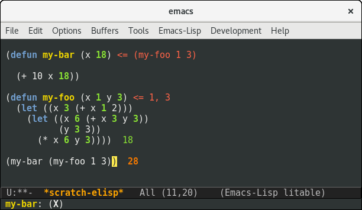

litable  
=======

On-the-fly evaluation of emacs lisp. Inspired by Light Table.

To start this up, simply enable the litable minor mode in the buffer by calling `M-x litable-mode`.

Litable keeps a list of pure functions as a safeguard for unwanted evaluations. A function must first be accepted into this list (using `M-x litable-accept-as-pure`) before it can be evaluated on-the-fly. You should take care of what function you accept as pure to avoid any unfortunate accidents. Also, note that the pure functions list persists across sessions.

Not meant to be used in production yet, be warned!

Demos
=====

There's also a screencast available: https://www.youtube.com/watch?v=mNO-vgq3Avg [1:50]

Contribute
=======

* If you feel like contributing, there are **TODO** annotations in the code. Mostly basic/trivial stuff, good exercise for people starting with elisp.
* If you have more substantial ideas, start an issue so we can discuss it. I'm open to all ideas, this is simply a precaution for people to not work on the same feature.
* If you want, you can [throw a couple bucks my way](https://www.paypal.com/cgi-bin/webscr?cmd=_s-xclick&hosted_button_id=A5PMGVKCQBT88) or support me on [Patreon](https://www.patreon.com/user?u=3282358&ty=h) \(we have a long way to beat that $300k goal people!\).
